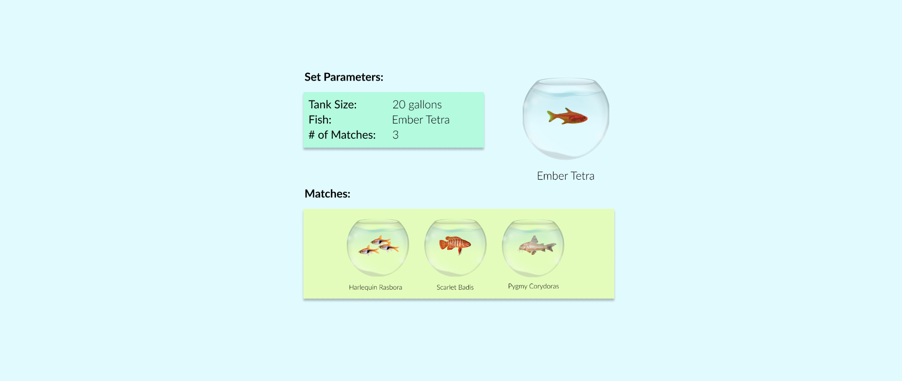
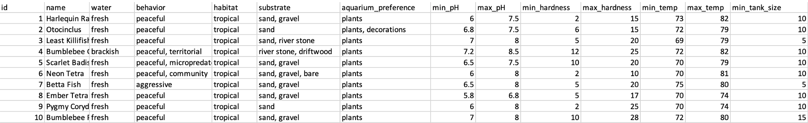
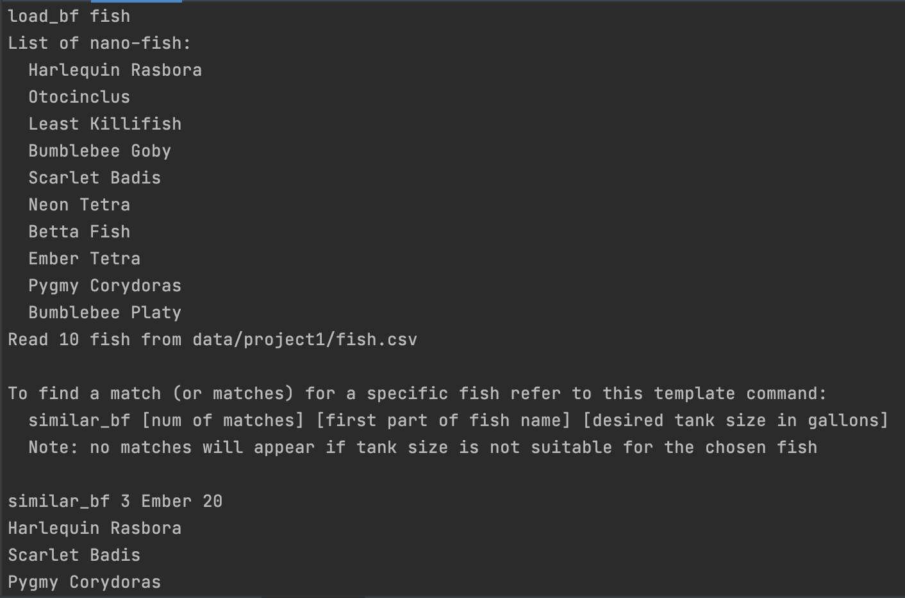

# Bloom Filter Recommender

Bloom Filter Recommender is a personal project I developed to allow aquarium hobbyists to find compatible tank-mate options for their nano-fish. It uses bloom filters to find similar fish out of a CSV Database of nano-fish. I developed a generic, re-usable REPL and CSV Reader and incorporated them into the project.

    

## Table of Contents
* [Technologies Used](#technologies-used)
* [General Info](#general-info)
* [Implementation](#implementation)
* [Features](#features)
* [Testing](#testing)
* [Usage Instructions](#usage-instructions)
* [Project Status](#project-status)
<!-- * [License](#license) -->

## Technologies Used
Java, Node.js

## General Info

The Java application was built upon the foundation of a generic REPL (Read–eval–print loop) that I developed to be able to handle any command that it is added to its command database. It also heavily relies on a generic CSV reader that I created to parse any csv file into a set of objects.

## Implementation

I created a CSV file with a list of nano-fish and their corresponding data. I included qualitative information for each fish regarding their habitat of origin, aquarium plant and substrate preferences and water salinity (freshwater or brackish). I also included quantitative information, including the ranges of pH, temperature, and hardness that the fish can tolerate and the minimum tank size that would be suitable for them.

    
     
above: Showing examples of the information stored in the CSV file.

I set out to create an REPL-based application that could be passed in a fish species name and a tank size and output a certain number of species that could be suitably added to the same tank. The application would have to produce matches based on the qualitative attributes of the fishes. However, it must also ensure that the recommended fish have water parameter ranges that are compatible with those of the given fish.

To find fishes with similar qualitative attributes, I had to find a way to efficiently compare the attributes. I achieved this using bloom filters, which are space-efficient probabilities data structures that are used to test whether an element is a member of a set. I wrote Java classes to create bloom filters, insert information into them and query them. I also implemented an algorithm that evaluates how similar two bloom filters are to each other using XNOR logic. Using the bloom filter data structure and methods that I implemented, I created a bloom filter for every fish in the csv file and loaded the filters with their qualitative data. This allowed me to efficiently check how similar two fish are to each other based on their qualitative information.

My project end goal was to design a fish recommender that could find a given number of suitable matches for a given fish species. Firstly, fish with water parameter ranges and a minimum tank size that are not compatible with those of the given fish were excluded from the similarity search. Then, I used a priority queue to compare the bloom filter of the given fish species to that of every other valid fish in the list. This recommender algorithm would then output a list of matches in order of greatest similarity to least.

## Features

The final product entails a REPL with two main commands. The first command “load_bf fish” creates a bloom filter for each fish in the CSV file and loads them with their qualitative data. It outputs the full list of fish in the CSV file and instructions to guide the user. The second command “similar_bf [k] [name] [tank size]” finds k matches for a fish species given its name and the tank size (in gallons). It outputs the list of matches in order from most similar to least.

    
     
    above: Showing the REPL in action and the outputs from calling load_bf and similar_bf.

## Testing

To test the functionality of the bloom filter REPL commands, system tests were written for each relevant command. JUnit tests were also written to verify that all the bloom filter operations were implemented correctly.

## Usage Instructions

Run these commands in the terminal:

    mvn package

    ./run --gui

    load_bf fish

    similar_bf [number of matches desired] [first part of fish name] [desired tank size in gallons]

e.g. of using similar_bf to find 4 matches for a Neon Tetra fish in a 10 gallon tank

     similar_bf 4 Neon 10

Notes:
- "load_bf fish" will output a list of fish.
- similar_bf finds a specified number of matches for a fish, given a tank size.

## Project Status
Project is: Complete (as of May 2022)

